# Mermaid 图表完全指南

Mermaid 是一个基于 JavaScript 的图表绘制工具，让你可以用简单的文本代码创建各种类型的图表。

在知夏笔记中，只需使用 `\`\`\`mermaid` 代码块即可。

---

## 📊 流程图 (Flowchart)

### 基础流程图

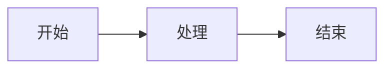
```mermaid
flowchart LR
    A[开始] --> B[处理]
    B --> C[结束]
```

### 带判断的流程图

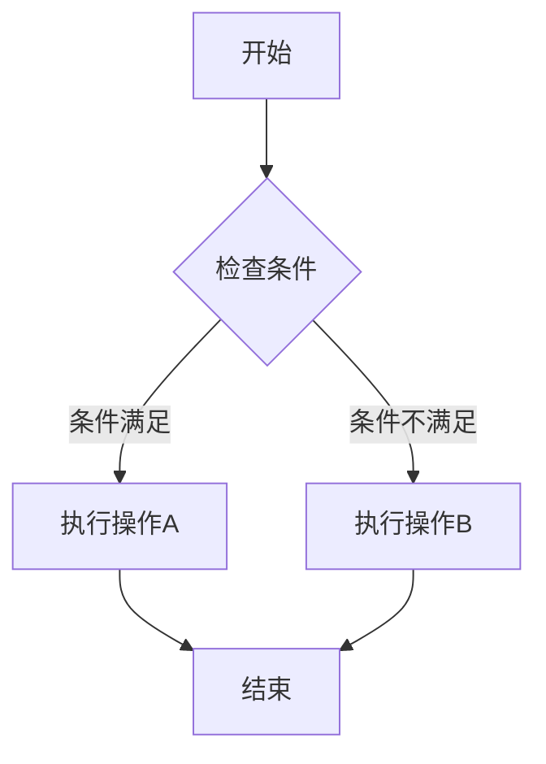
```mermaid
flowchart TD
    A[开始] --> B{检查条件}
    B -->|条件满足| C[执行操作A]
    B -->|条件不满足| D[执行操作B]
    C --> E[结束]
    D --> E
```

### 复杂业务流程

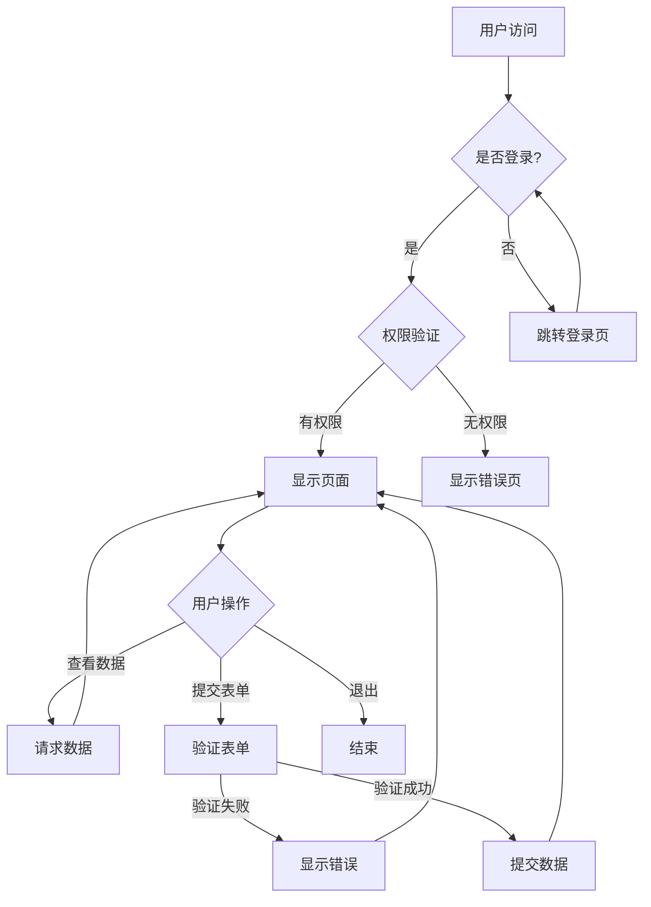
```mermaid
flowchart TD
    Start[用户访问] --> Login{是否登录?}
    Login -->|是| CheckAuth{权限验证}
    Login -->|否| LoginPage[跳转登录页]
    LoginPage --> Login

    CheckAuth -->|有权限| ShowPage[显示页面]
    CheckAuth -->|无权限| ErrorPage[显示错误页]

    ShowPage --> Action{用户操作}
    Action -->|查看数据| GetData[请求数据]
    Action -->|提交表单| Validate[验证表单]
    Action -->|退出| End[结束]

    Validate -->|验证失败| ShowError[显示错误]
    Validate -->|验证成功| Submit[提交数据]
    Submit --> ShowPage

    GetData --> ShowPage
    ShowError --> ShowPage
```

### 样式化流程图

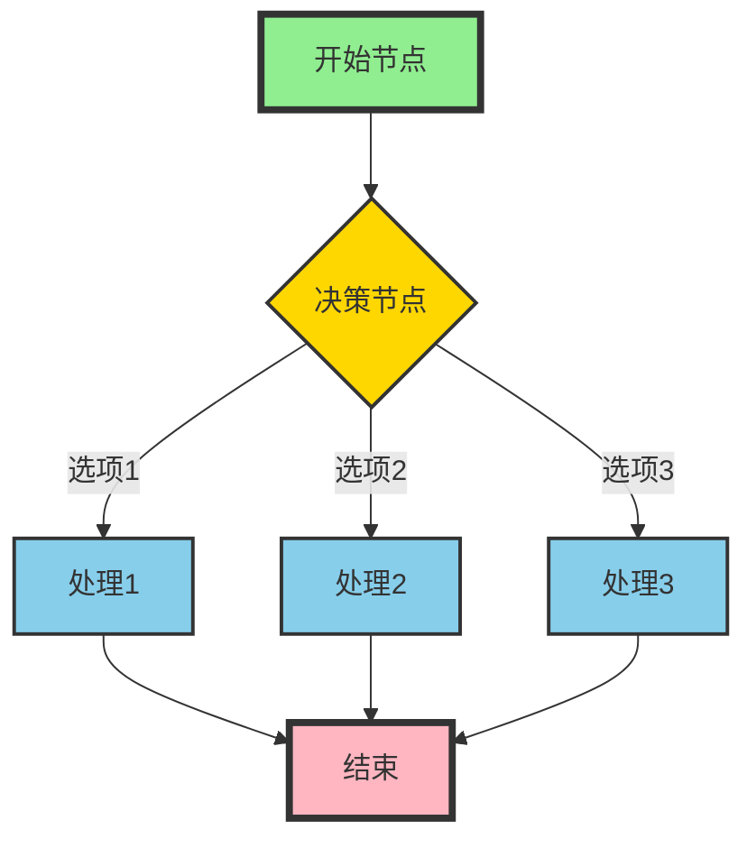
```mermaid
flowchart TD
    A[开始节点] --> B{决策节点}
    B -->|选项1| C[处理1]
    B -->|选项2| D[处理2]
    B -->|选项3| E[处理3]

    C --> F[结束]
    D --> F
    E --> F

    style A fill:#90EE90,stroke:#333,stroke-width:4px
    style B fill:#FFD700,stroke:#333,stroke-width:2px
    style C fill:#87CEEB,stroke:#333,stroke-width:2px
    style D fill:#87CEEB,stroke:#333,stroke-width:2px
    style E fill:#87CEEB,stroke:#333,stroke-width:2px
    style F fill:#FFB6C1,stroke:#333,stroke-width:4px
```

### 子图（分组）

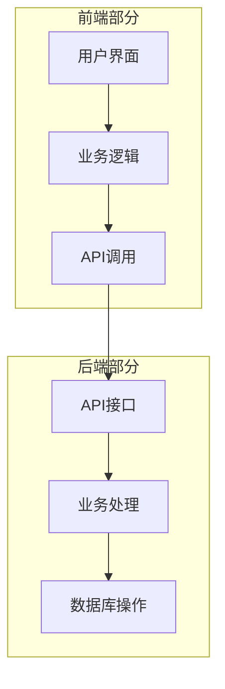
```mermaid
flowchart TD
    subgraph 前端 [前端部分]
        A1[用户界面] --> A2[业务逻辑]
        A2 --> A3[API调用]
    end

    subgraph 后端 [后端部分]
        B1[API接口] --> B2[业务处理]
        B2 --> B3[数据库操作]
    end

    A3 --> B1
```

---

## 🔄 时序图 (Sequence Diagram)

### 基础时序图

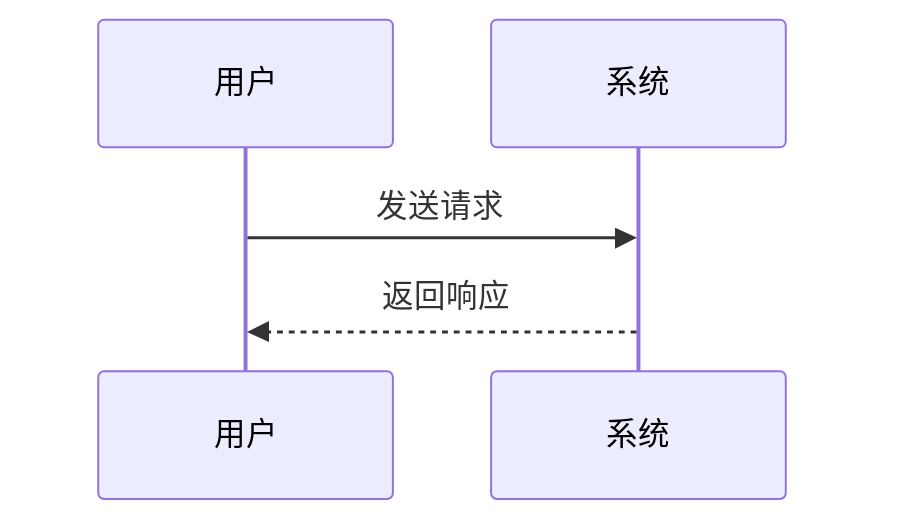
```mermaid
sequenceDiagram
    participant A as 用户
    participant B as 系统
    A->>B: 发送请求
    B-->>A: 返回响应
```

### 完整的用户认证流程

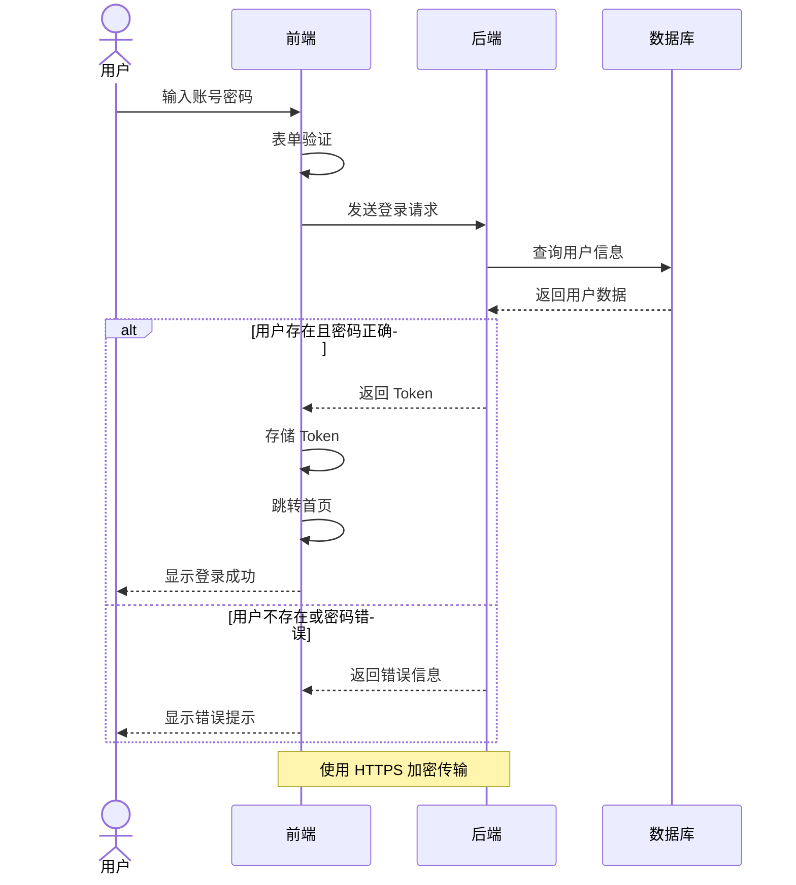
```mermaid
sequenceDiagram
    actor 用户
    participant 前端
    participant 后端
    participant 数据库

    用户->>前端: 输入账号密码
    前端->>前端: 表单验证
    前端->>后端: 发送登录请求

    后端->>数据库: 查询用户信息
    数据库-->>后端: 返回用户数据

    alt 用户存在且密码正确
        后端-->>前端: 返回 Token
        前端->>前端: 存储 Token
        前端->>前端: 跳转首页
        前端-->>用户: 显示登录成功
    else 用户不存在或密码错误
        后端-->>前端: 返回错误信息
        前端-->>用户: 显示错误提示
    end

    Note over 前端,后端: 使用 HTTPS 加密传输
```

### 异步消息处理

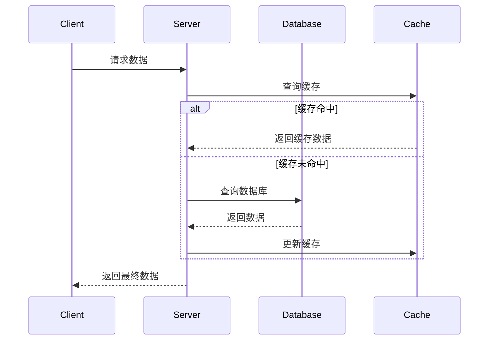
```mermaid
sequenceDiagram
    participant Client
    participant Server
    participant Database
    participant Cache

    Client->>Server: 请求数据
    Server->>Cache: 查询缓存

    alt 缓存命中
        Cache-->>Server: 返回缓存数据
    else 缓存未命中
        Server->>Database: 查询数据库
        Database-->>Server: 返回数据
        Server->>Cache: 更新缓存
    end

    Server-->>Client: 返回最终数据
```

### 带循环和条件的时序图

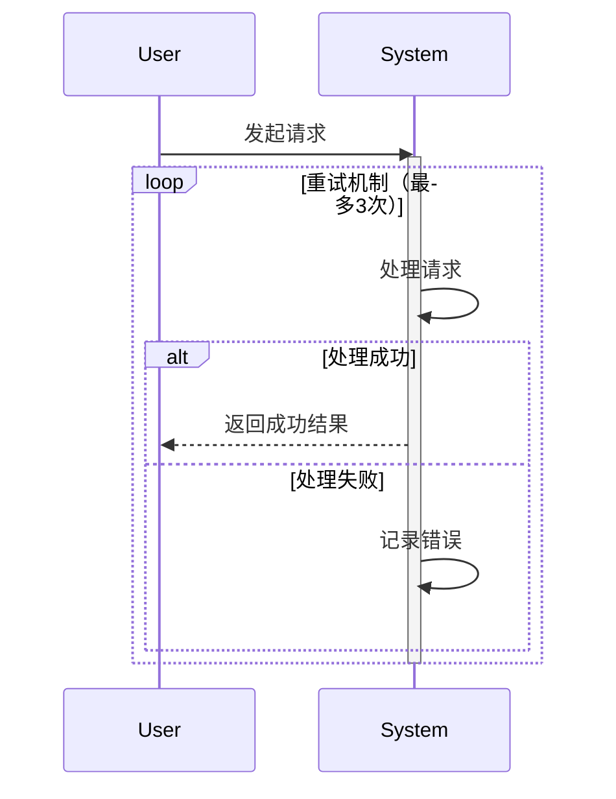
```mermaid
sequenceDiagram
    participant User
    participant System

    User->>System: 发起请求
    activate System

    loop 重试机制（最多3次）
        System->>System: 处理请求
        alt 处理成功
            System-->>User: 返回成功结果
        else 处理失败
            System->>System: 记录错误
        end
    end

    deactivate System
```

---

## 🏛️ 类图 (Class Diagram)

### 基础类图

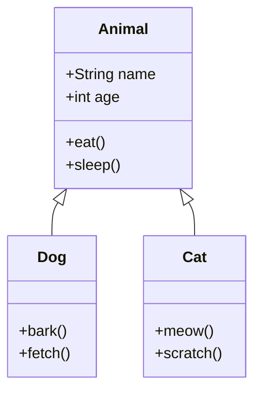
```mermaid
classDiagram
    class Animal{
        +String name
        +int age
        +eat()
        +sleep()
    }
    class Dog{
        +bark()
        +fetch()
    }
    class Cat{
        +meow()
        +scratch()
    }

    Animal <|-- Dog
    Animal <|-- Cat
```

### 电商系统类图

```mermaid
classDiagram
    class User {
        +String userId
        +String username
        +String email
        +register()
        +login()
        +logout()
    }

    class Order {
        +String orderId
        +Date createTime
        +String status
        +addItem()
        +checkout()
        +cancel()
    }

    class Product {
        +String productId
        +String name
        +float price
        +int stock
        +updateStock()
    }

    class Payment {
        +String paymentId
        +float amount
        +String status
        +process()
        +refund()
    }

    User "1" --> "*" Order : 下单
    Order "*" --> "*" Product : 包含
    Order "1" --> "1" Payment : 支付

    noteForUser "用户可以注册、登录、下单、查看订单"
    noteForOrder "订单包含多个商品，对应一次支付"
```

### 接口与实现

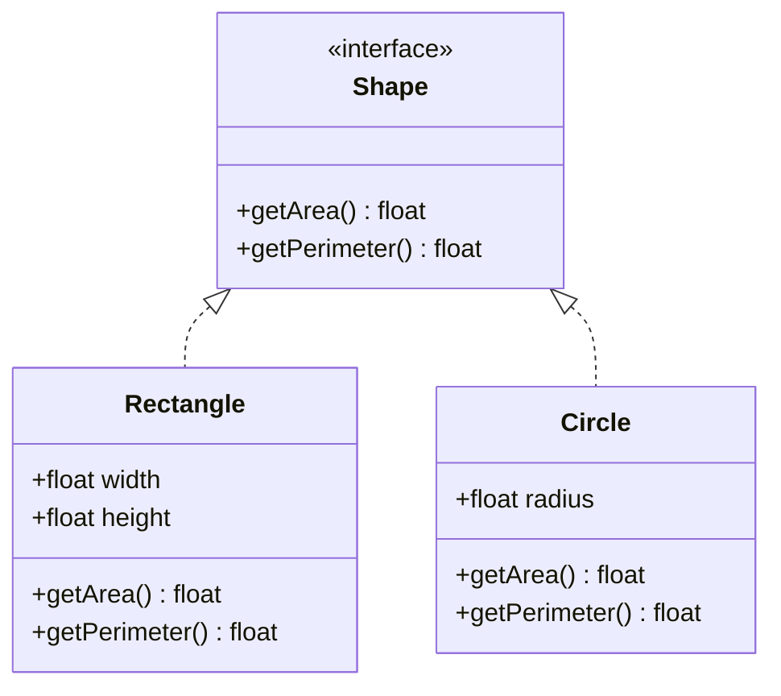
```mermaid
classDiagram
    class Shape{
        <<interface>>
        +getArea() float
        +getPerimeter() float
    }
    class Rectangle{
        +float width
        +float height
        +getArea() float
        +getPerimeter() float
    }
    class Circle{
        +float radius
        +getArea() float
        +getPerimeter() float
    }

    Shape <|.. Rectangle
    Shape <|.. Circle
```

---

## 🌳 状态图 (State Diagram)

### 订单状态流转

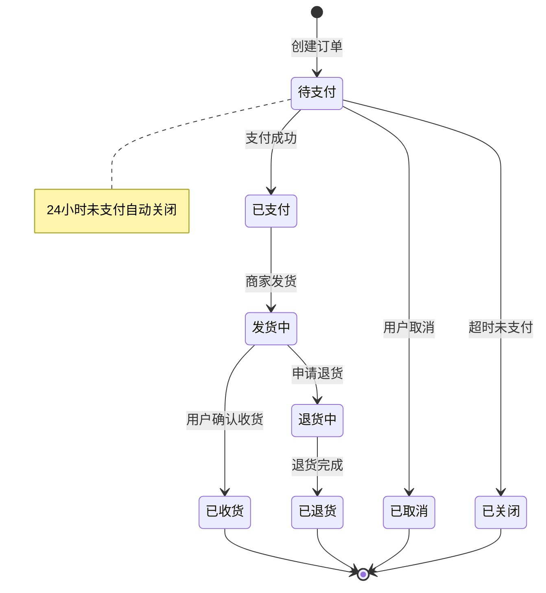
```mermaid
stateDiagram-v2
    [*] --> 待支付: 创建订单
    待支付 --> 已支付: 支付成功
    待支付 --> 已取消: 用户取消
    待支付 --> 已关闭: 超时未支付

    已支付 --> 发货中: 商家发货
    发货中 --> 已收货: 用户确认收货
    发货中 --> 退货中: 申请退货

    已收货 --> [*]
    退货中 --> 已退货: 退货完成
    已退货 --> [*]

    已取消 --> [*]
    已关闭 --> [*]

    note right of 待支付
        24小时未支付自动关闭
    end note
```

### 用户登录状态

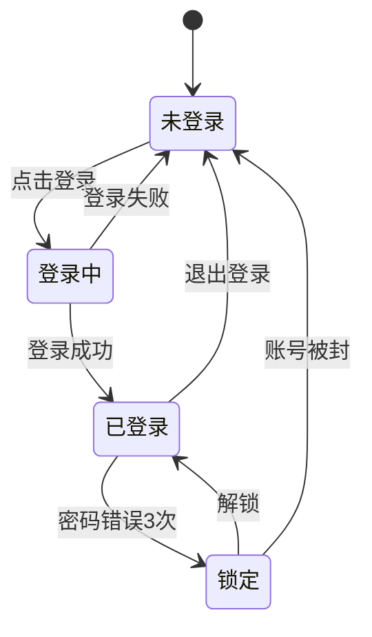
```mermaid
stateDiagram-v2
    [*] --> 未登录
    未登录 --> 登录中: 点击登录
    登录中 --> 已登录: 登录成功
    登录中 --> 未登录: 登录失败

    已登录 --> 未登录: 退出登录
    已登录 --> 锁定: 密码错误3次

    锁定 --> 已登录: 解锁
    锁定 --> 未登录: 账号被封
```

---

## 🗺️ 思维导图 (Mindmap)

### 项目规划思维导图

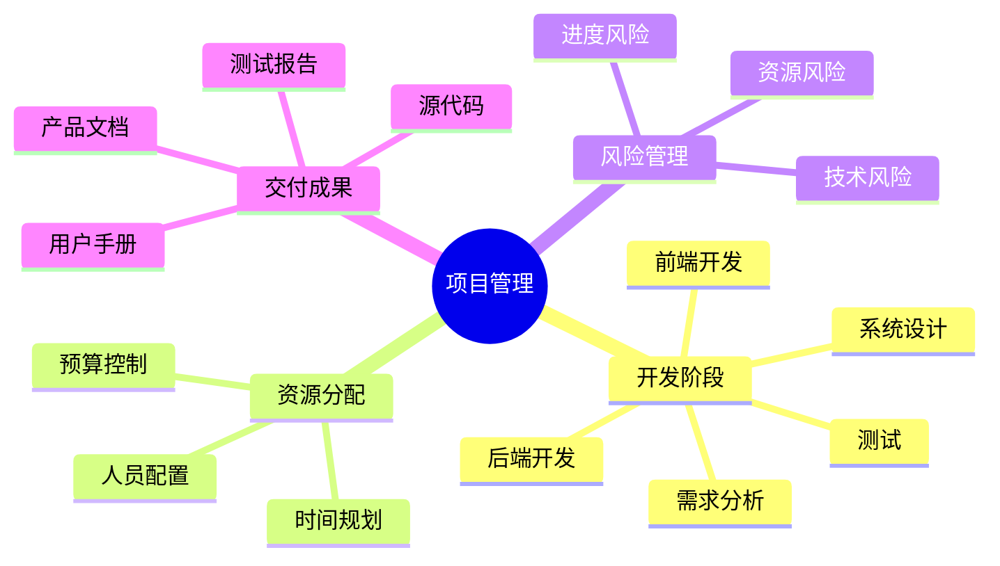
```mermaid
mindmap
  root((项目管理))
    开发阶段
      需求分析
      系统设计
      前端开发
      后端开发
      测试
    资源分配
      人员配置
      时间规划
      预算控制
    风险管理
      技术风险
      进度风险
      资源风险
    交付成果
      产品文档
      源代码
      测试报告
      用户手册
```

### 学习路线图

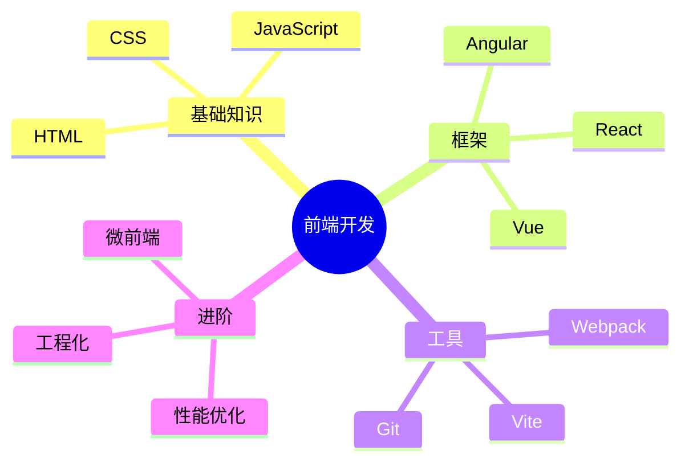
```mermaid
mindmap
  root((前端开发))
    基础知识
      HTML
      CSS
      JavaScript
    框架
      React
      Vue
      Angular
    工具
      Webpack
      Vite
      Git
    进阶
      性能优化
      工程化
      微前端
```

---

## 📅 甘特图 (Gantt Chart)

### 项目开发计划

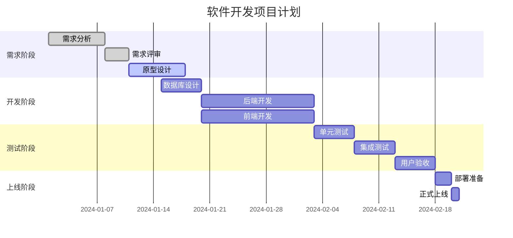
```mermaid
gantt
    title 软件开发项目计划
    dateFormat YYYY-MM-DD
    section 需求阶段
    需求分析       :done,    req1, 2024-01-01, 7d
    需求评审       :done,    req2, after req1, 3d
    原型设计       :active,  req3, after req2, 7d

    section 开发阶段
    数据库设计     :         dev1, 2024-01-15, 5d
    后端开发       :         dev2, after dev1, 14d
    前端开发       :         dev3, after dev1, 14d

    section 测试阶段
    单元测试       :         test1, after dev3, 5d
    集成测试       :         test2, after test1, 5d
    用户验收       :         test3, after test2, 5d

    section 上线阶段
    部署准备       :         deploy1, after test3, 2d
    正式上线       :         deploy2, after deploy1, 1d
```

### 多任务并行甘特图

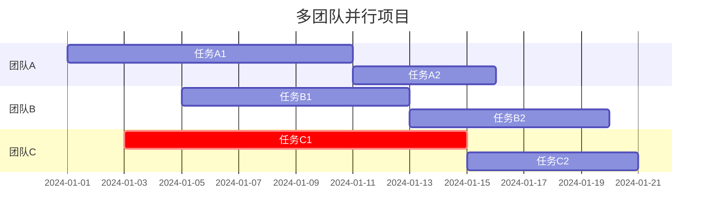
```mermaid
gantt
    title 多团队并行项目
    dateFormat YYYY-MM-DD
    section 团队A
    任务A1          :a1, 2024-01-01, 10d
    任务A2          :a2, after a1, 5d

    section 团队B
    任务B1          :b1, 2024-01-05, 8d
    任务B2          :b2, after b1, 7d

    section 团队C
    任务C1          :crit, c1, 2024-01-03, 12d
    任务C2          :c2, after c1, 6d
```

---

## 📈 饼图 (Pie Chart)

### 时间分配

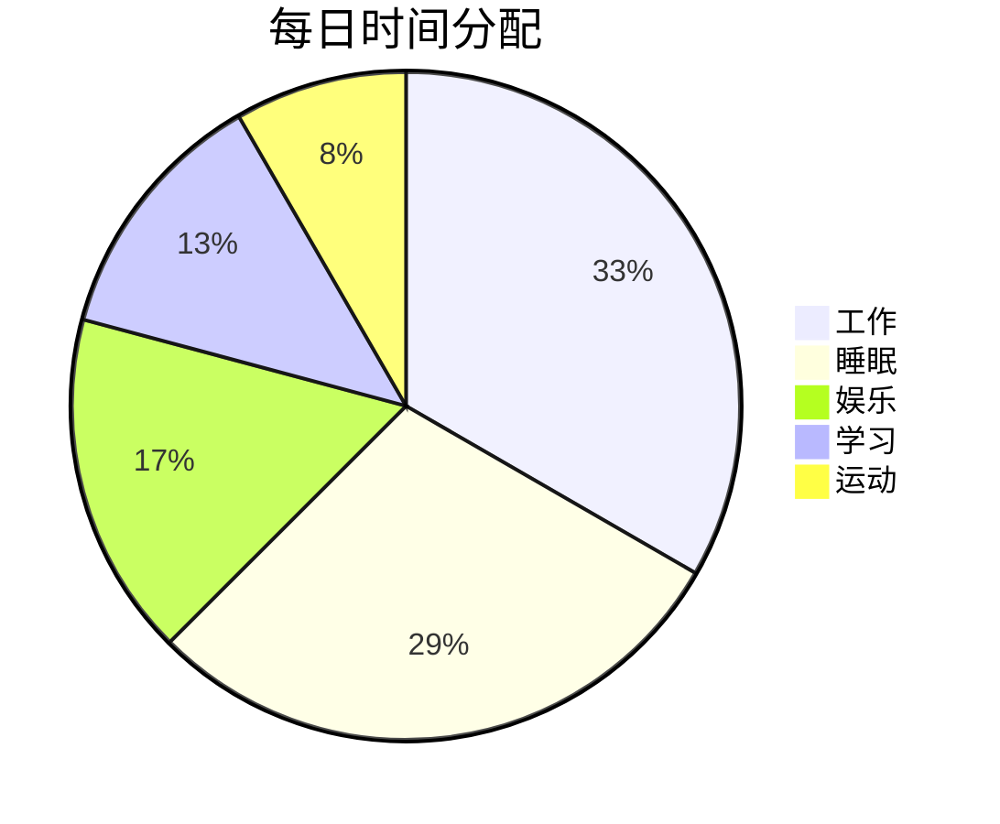
```mermaid
pie title 每日时间分配
    "工作" : 8
    "睡眠" : 7
    "娱乐" : 4
    "学习" : 3
    "运动" : 2
```

### 项目进度

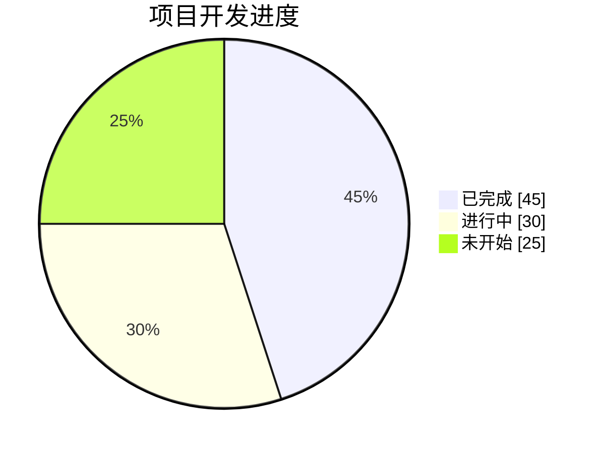
```mermaid
pie showData
    title 项目开发进度
    "已完成" : 45
    "进行中" : 30
    "未开始" : 25
```

---

## 🔗 关系图 (Relationship Diagram)

### 社交网络关系

```mermaid
graph TD
    A[张三] --- B[李四]
    A --- C[王五]
    B --- C
    C --- D[赵六]
    D -.-> A[老同学]
    B ==>|关注| E[公众号]
```

### 系统依赖关系

```mermaid
graph LR
    A[前端应用] --> B[API网关]
    B --> C[认证服务]
    B --> D[业务服务]
    B --> E[文件服务]

    D --> F[(数据库)]
    E --> G[(对象存储)]

    C --> H[(Redis)]
```

---

## 🗺️ 旅程图 (Journey Diagram)

### 用户购物旅程

```mermaid
journey
    title 购物之旅
    section 浏览商品
      浏览首页: 5: 用户
      搜索商品: 4: 用户
      查看详情: 3: 用户
    section 下单购买
      加入购物车: 5: 用户
      填写地址: 3: 用户
      选择支付: 4: 用户
      确认订单: 5: 用户
    section 售后服务
      查看物流: 4: 用户
      确认收货: 5: 用户
      申请退货: 2: 用户
```

---

## 🔀 实体关系图 (Entity Relationship)

### 数据库ER图

```mermaid
erDiagram
    CUSTOMER ||--o{ ORDER : places
    CUSTOMER {
        string name
        string email
        string phone
    }
    ORDER ||--|{ LINE_ITEM : contains
    ORDER {
        int order_id
        date created_at
        string status
    }
    PRODUCT ||--o{ LINE_ITEM : ""
    PRODUCT {
        int product_id
        string name
        float price
    }
    LINE_ITEM {
        int quantity
        float unit_price
    }
```

---

## 💡 使用技巧

### 1. 注释和说明

```mermaid
graph TD
    A[开始] --> B[处理]
    %% 这是一条注释
    B --> C[结束]

    note1[这是一个说明框]
    note1 --> A
```

### 2. 子图嵌套

```mermaid
graph TB
    subgraph 主系统
        A[模块A] --> B[模块B]
        subgraph 子系统
            C[子模块1] --> D[子模块2]
        end
        B --> C
    end
```

### 3. 样式类（CSS类）

```mermaid
flowchart TD
    A[样式1] --> B[样式2]
    B --> C[样式3]

    classDef default fill:#f9f,stroke:#333,stroke-width:2px;
    classDef important fill:#ff9,stroke:#333,stroke-width:4px;

    class A,C important;
    class B default;
```

### 4. 超链接和点击事件

```mermaid
graph TD
    A[点击跳转] --> B[目标节点]

    click A "https://zhixia.example.com" _blank
    click B callCallback()
```

### 5. Unicode 和特殊字符

```mermaid
flowchart LR
    A[✅ 已完成]
    B[⏳ 进行中]
    C[❌ 未开始]
    D[🔥 高优先级]
    E[⭐ 重要]

    A --> B --> C
    D --> E
```

---

## 🎨 常用颜色方案

### 渐变色

```mermaid
flowchart LR
    A[绿色] --> B[蓝色] --> C[紫色] --> D[红色]

    style A fill:#90EE90
    style B fill:#87CEEB
    style C fill:#DDA0DD
    style D fill:#FFB6C1
```

### 业务状态颜色

```mermaid
flowchart TD
    A[✓ 成功]
    B[⚠ 警告]
    C[✗ 错误]
    D[ℹ 信息]

    style A fill:#d4edda,stroke:#28a745,stroke-width:3px
    style B fill:#fff3cd,stroke:#ffc107,stroke-width:3px
    style C fill:#f8d7da,stroke:#dc3545,stroke-width:3px
    style D fill:#d1ecf1,stroke:#17a2b8,stroke-width:3px
```

---

## 📚 最佳实践

1. **命名规范** - 使用有意义的节点名称
2. **布局优化** - 合理使用方向（TD/LR）
3. **样式统一** - 保持颜色和字体风格一致
4. **注释说明** - 复杂图表添加注释
5. **测试渲染** - 确保在不同屏幕下都能正常显示

---

## 🔧 常见问题

**Q: 如何调整图表大小？**
A: 图表大小是自动的，但可以通过调整文字长度和节点数量来控制

**Q: 中文显示乱码？**
A: 确保文件编码为 UTF-8

**Q: 如何导出图表？**
A: 可以截图或使用浏览器的打印功能保存为 PDF

---

> 💡 **更多资源**：
> - [Mermaid 官方文档](https://mermaid.js.org/)
> - [Mermaid 在线编辑器](https://mermaid.live/)
> - [Mermaid GitHub](https://github.com/mermaid-js/mermaid)
